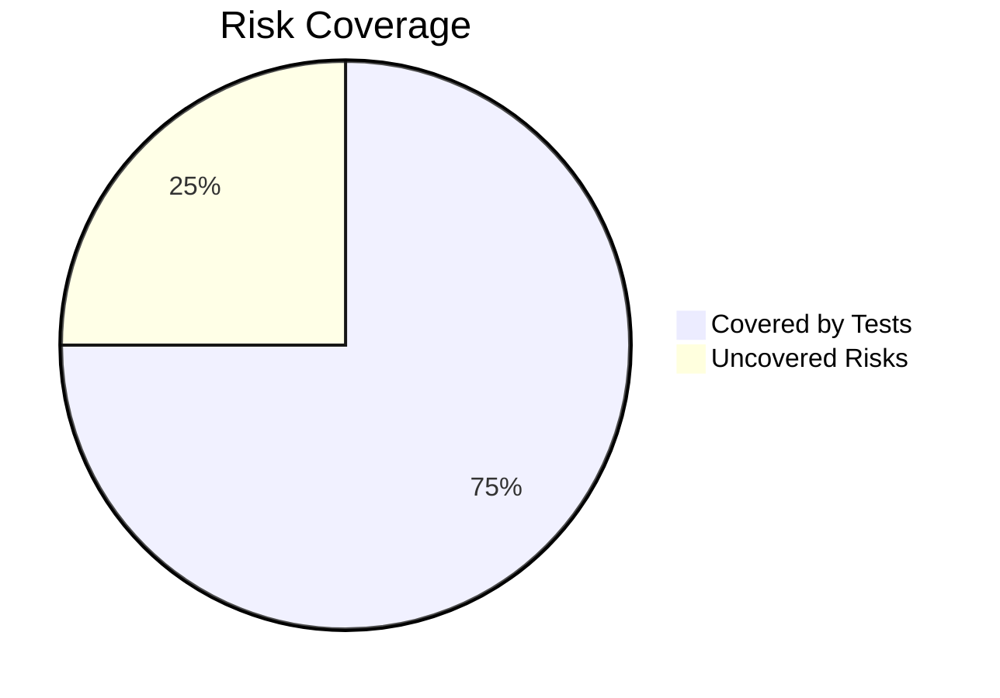

# Final Test Report – CleanCity Scheduler 

**Version:** 1.0  
**Tester:** Mpumelelo Theophilas Nxazonke  
**Date:** 2025-06-23  
**Environment:** Chrome 125 (Windows 10), VS Code, GitHub  
**Test Tools:** Jest, GitHub Issues, Manual Testing  

---

## 1. Test Plan  

[View Full Test_Plan.md](./final_docs/Test_Plan.md)

### Summary:

- **Objectives**: Verify functionality of game features and UI, validate scoring and input logic, ensure traceability.
- **Scope**: Functional testing of word scramble, scoring, hints, JSON loading, basic UI responsiveness.
- **Resources**: Tester, QA Reviewers, VS Code, Chrome, GitHub.
- **Schedule**: 2025-06-21 → 2025-06-24.
- **Entry Criteria**: Code pushed to GitHub, word bank integrated.
- **Exit Criteria**: All high-priority tests executed; major bugs logged.

---

## 2. Test Strategy  

[View Full Test_Strategy.md](./final_docs/Test_Strategy.md)

### Testing Approach:

- **Unit Testing**: Pure logic tested using Jest (e.g., word scrambling, score updates).
- **Functional Testing**: Manual interaction in the browser (Chrome).
- **Exploratory Testing**: Manual checks for unexpected behavior.
- **Defect Tracking**: Via GitHub Issues, linked to test cases.
- **Risk-Based Testing**: Focused on scoring, hint logic, JSON load.

---

## 3. Risk Analysis  

[View Full Risk_Analysis.md](./final_docs/Risk_Analysis.md)

| Risk Description                     | Likelihood | Impact | Mitigation                                |
|-------------------------------------|------------|--------|-------------------------------------------|
| Score does not reset correctly      | Medium     | High   | Test new game → reset validation (TC10)   |
| Hint system deducts too many points | Medium     | High   | Restrict deduction → single trigger logic |
| Word not scrambled                  | Low        | Medium | Loop until scramble ≠ original (TC02)     |
| UI breaks on mobile                 | Medium     | Low    | Responsive checks (TC14)                  |

### Two risks materialized:

- TC10 – Score reset failed
- TC14 – Layout not mobile responsive  

### Risk Coverage:

---

## 4. Traceability Matrix  

[View Full Traceability_Matrix.md](./docs/Traceability_Matrix.md)

| **Requirement ID** | **Test Case ID** | **Status**  | **Bug Reference**                         |
|--------------------|------------------|-------------|-------------------------------------------|
| FR1–FR9            | TC01–TC13        |  Pass       |                                           |
| FR10               | TC-10            |  Fail       | [Issue #1: TC10_ResetFail](link)          |
| NFR1               | TC-14            |  Fail       | [Issue #2: TC14_ResponsiveLayoutFail](link) |
| NFR2–NFR4, UX      | TC15–TC18        |  Pass       |                                           |
| Error Handling     | TC19             |  Pass       |                                           |
| Performance        | TC20             |  Pass       |                                           |

**Requirement Coverage Summary:**

- **FR1**: TC-01, TC-02
- **FR4 (Scoring)**: TC-05, TC-06
- **FR6 (Hint)**: TC-08, TC-09
- **FR7 (Reset)**: TC-10 [Bug Report Linked]
- **FR9 (JSON)**: TC-12 
- **NFR1**: TC-14

**Coverage Status**:  
All functional and non-functional requirements have at least one test case assigned. Bug tracking is active via GitHub Issues.

---

## 5. Test Cases  

[View Full Test_Cases.md](./docs/Test_Cases.md)  

20 test cases were created based on the requirements. Each test case contains:

- Test ID
- Description
- Expected Result
- Status (pass/fail)
- Linked Bug Report (if applicable)

---

## 6. Test Execution Summary

[View Full Test_Execution_Report.md](./docs/Test_Execution_Report.md)

| Metric                    | Result      |
|---------------------------|-------------|
| Total Test Cases          | 20          |
| Passed                    | 18          |
| Failed                    | 2           |
| Bugs Logged               | 2           |
| High-Risk Features Tested | Yes         |
| Regression Tested         | Yes         |
| Exploratory Tested        | Yes         |

---

## 7. Bug Report  

[View Full Bug_Report.md](./docs/Bug_Report.md)

| Bug ID  | Title                         | Severity | Status |
|---------|-------------------------------|----------|--------|
| #1      | Score does not reset (TC10)   | High     | Open   |
| #2      | UI breaks on small screens    | Medium   | Open   |

🖼️ Screenshots attached in `/images/` folder for evidence:  

- `TC10_ResetFail.png`  
- `TC14_ResponsiveLayoutFail.png`

---

## 8. Conclusion & Reflection

- The team displayed a habit of working in siloes, often reaching out only when tasks were completed. This resulted in a predominantly single-opinion test approach, highlighting a leadership style that is more laissez-faire and communication that could benefit from increased collaboration among testers.
- Gaining a thorough understanding of the full Software Testing Life Cycle (STLC) and how its various stages contribute to a cohesive, industry-standard QA reporting workflow has been very insightful.
- Time management remains a crucial challenge, especially when balancing testing duties alongside other personal commitments. Greater mindfulness and realistic scheduling are essential for future projects.
- Performing a risk analysis proved invaluable, allowing me to focus on features most critical to gameplay stability, such as scoring and hint logic, rather than spreading efforts too thin.
- Trade-offs were necessary between comprehensive UI testing coverage and deep testing of high-risk, core functional features, given the limited timeframe.
- While adopting Jest for unit and logic testing could have earned bonus points and helped detect subtle bugs beyond the UI layer, time constraints led to deprioritizing this approach.
- Overall, the core functionality of the Word Puzzle Game is working as expected, with all logic-related test cases (scrambling, scoring, hints, input validation) passing successfully.
- However, UI-related bugs remain open and must be addressed prior to production deployment to ensure a polished user experience.

---

## Checklist

- [x] Test Plan created and reviewed  
- [x] Test Strategy implemented  
- [x] Risk Analysis conducted  
- [x] Test Cases written and linked  
- [x] Bugs reported via GitHub  
- [x] Test Execution completed and logged  
- [x] Final Test Report compiled  

---

## Related Links

- [GitHub Project Board](https://github.com/orgs/PLP-Database-Design/projects/2)
- [GitHub Issues](https://github.com/PLP-Database-Design/week-5-Sir-Poeksie/issues)

---